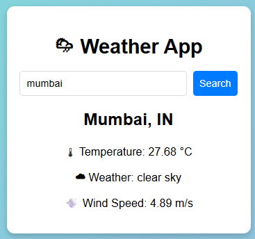

# 🌦 Weather App

A simple weather application built using HTML, CSS, and JavaScript.  
It fetches live weather data from the *OpenWeatherMap API* based on the city name entered by the user.

---

## 🚀 Features
- Search weather by city name
- Displays temperature, weather condition, and wind speed
- Responsive and clean UI
- Uses OpenWeatherMap API

---

## 📂 Project Structure

---

## 📸 Screenshot

---

## 🌐 Live Demo
[👉 Try the Weather App](https://xyzvikram.github.io/weather-app/)